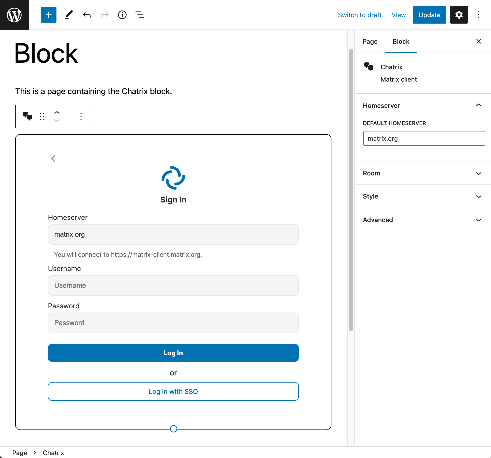
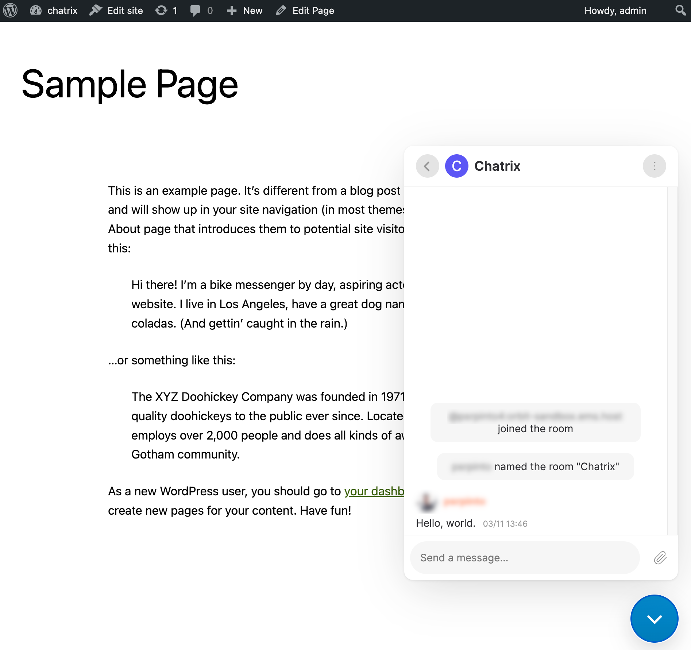
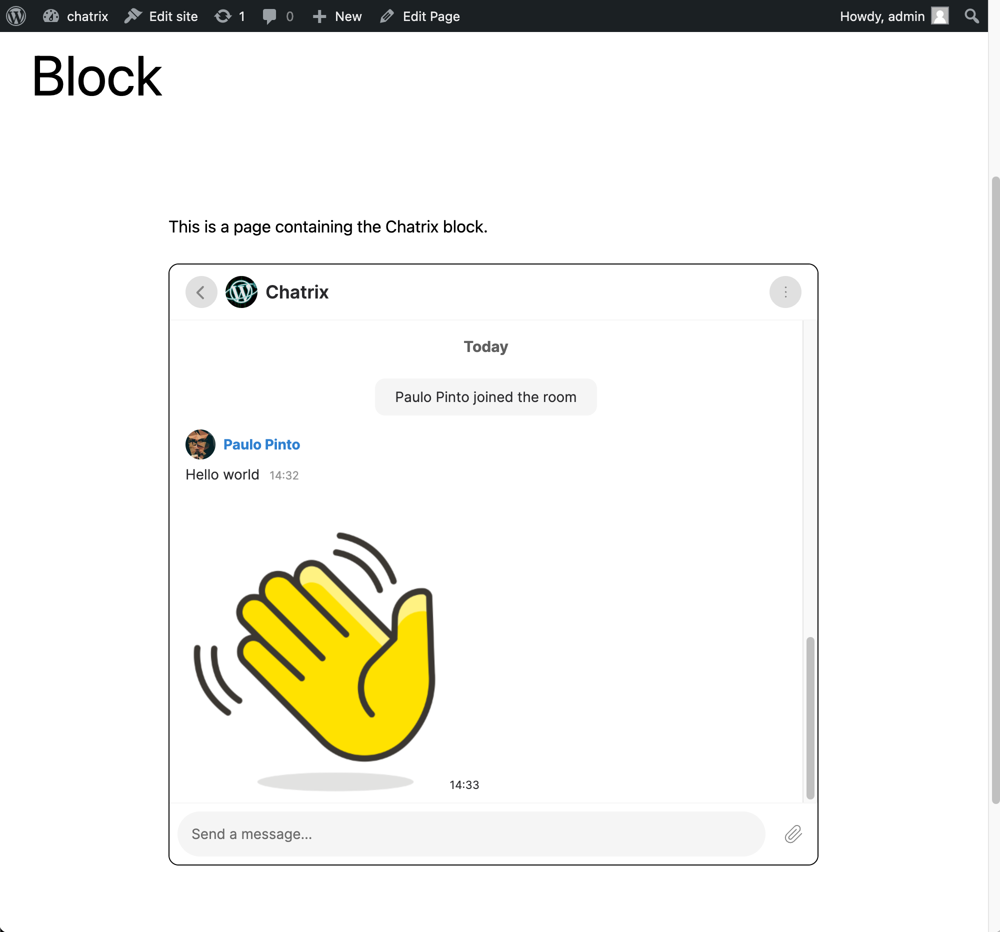
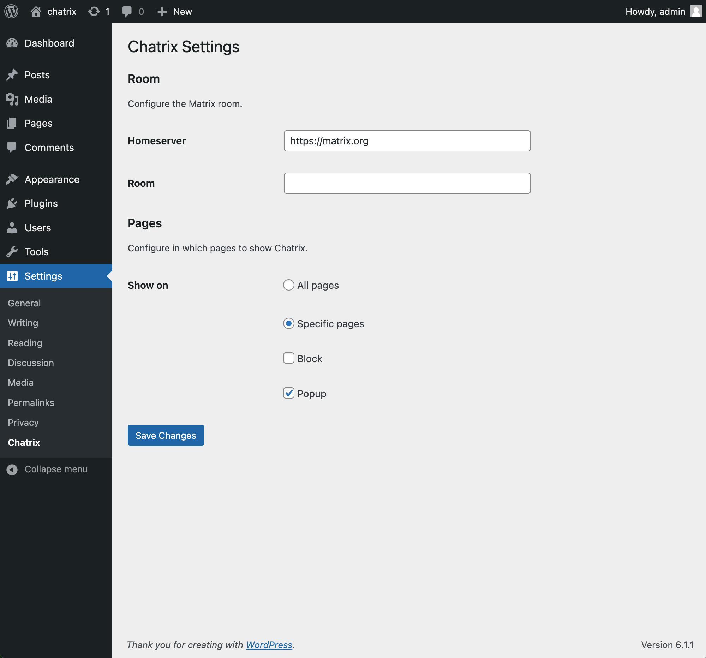
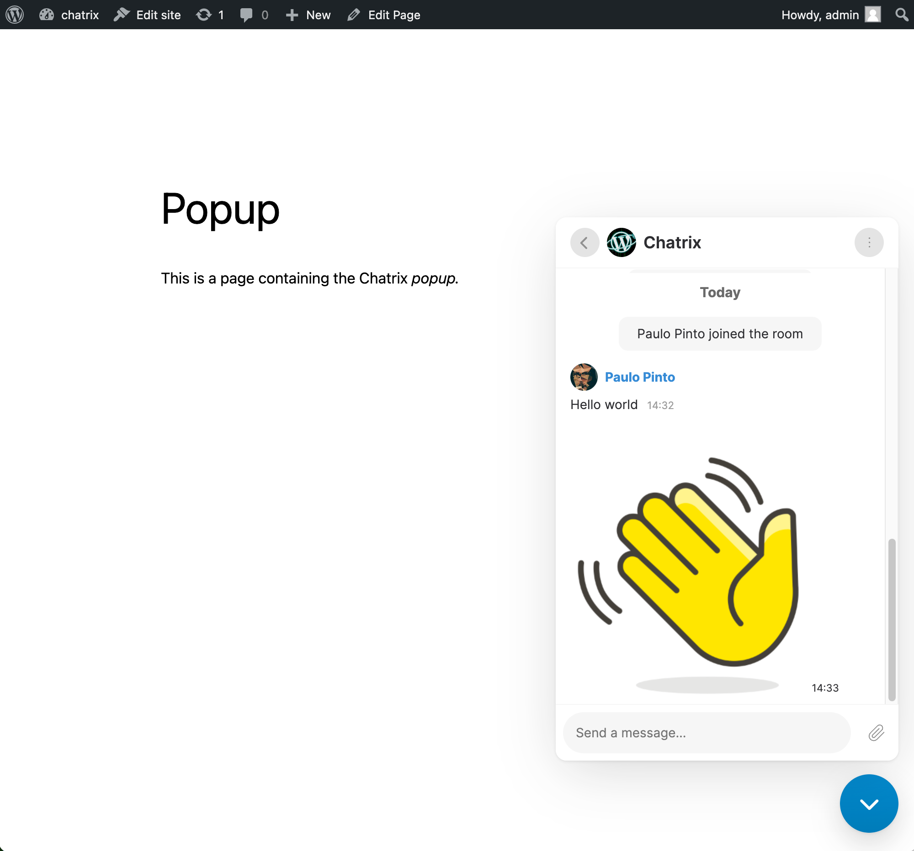

# Chatrix

- Contributors: wordpressdotorg, akirk, ashfame, psrpinto
- Tags: matrix, chat
- Requires at least: 6.0
- Tested up to: 6.5
- Requires PHP: 7.4
- License: [GPLv2](http://www.gnu.org/licenses/gpl-2.0.html)
- Stable tag: 0.9.1
- GitHub Plugin URI: https://github.com/Automattic/chatrix

Matrix client for WordPress.

## Description
Easily add a [Matrix](https://matrix.org) client to WordPress pages, either through the Block Editor, or as a _popup_.

### Feedback welcome
If you have any feedback or questions about Chatrix, please do talk to plugin maintainers at [#chatrix:matrix.org](https://matrix.to/#/#chatrix:matrix.org).

## Screenshots

## Frequently Asked Questions
### How can I install this plugin on my site?
This plugin can be used in two distinct ways:

1. By adding a block to a page through the block editor
2. By selecting pages in which a _popup_ will be displayed. You configure this through `Settings -> Chatrix`.

### Is there a more flexible way to configure the popup?
Yes. Instead of configuring the _popup_ through `Settings -> Chatrix`, you can configure it through code, by using the `chatrix_instances` filter:

~~~php
// functions.php

add_filter( 'chatrix_instances', function ( array $default_instances ) {
	// The key is an instance_id, the value array is the config for that instance.
	// Set 'pages' to an array of the ids of the pages which should show chatrix.
	// You can also set 'pages' to 'all' which results in that instance always being used.
	// Only one instance can be shown on a given page.
	return array(
		'foo' => array(
			'homeserver' => 'https://foo.com',
			'room_id'    => '!id:foo.com',
			'pages'      => 'all',
		),
		'bar' => array(
			'homeserver' => 'https://bar.com',
			'room_id'    => '!id:bar.com',
			'pages'      => array(1, 2, 3),
		),
	);
} );
~~~

### How can I configure WordPress user accounts to register and login on Matrix homeserver?
The plugin will respect the login methods configured on the Matrix homeserver. For example, if the homeserver has both password and SSO login enabled, both options will be available to the user.

In light of the [plan for Matrix to replace their user management with Open ID Connect (OIDC)](https://areweoidcyet.com/), we recommend to use a Single-Sign On (SSO) flow by configuring [Open ID Connect login on Synapse](https://matrix-org.github.io/synapse/latest/openid.html) and use the [OpenID Connect Server WordPress plugin](https://wordpress.org/plugins/openid-connect-server/).

The flow will then be as follows: When logging into your homeserver, it will redirect you to your own WordPress login page and ask you to authorize the login by the click of a button, and then relay your information to the homeserver. You'll be redirected back to your WordPress page and Chatrix will receive the login information and you can start chatting.

Later, when Matrix makes the switch to OIDC, you are already prepared and can continue to use this setup.

## Changelog

### 0.9.1
- We now don't enqueue scripts in embeds [#249](https://github.com/Automattic/chatrix/pull/249)
- It is now possible to disable service worker at runtime [#243](https://github.com/Automattic/chatrix/pull/243)

### 0.9.0

- Chatrix is now a single-session client. The session picker is no longer displayed [[#239](https://github.com/Automattic/chatrix/pull/239)]. This fixes [#236](https://github.com/Automattic/chatrix/issues/236) [#224](https://github.com/Automattic/chatrix/issues/224) [#200](https://github.com/Automattic/chatrix/issues/200).

### 0.8.3

- Improve the view for rooms that are you not a member of (Upgraded our Hydrogen's fork to [latest](https://github.com/Automattic/hydrogen-web/compare/chatrix-0.8.0...Automattic:hydrogen-web:chatrix-0.8.3))

### 0.8.2

- Fix issues with single-room mode and guest login [[#222](https://github.com/Automattic/chatrix/pull/222)]

### 0.8.1

- Correctly remember last url when multiple blocks are on the same page [[#217](https://github.com/Automattic/chatrix/pull/217)]

### 0.8.0

- Fix issue when chatrix plugin is not installed in the default location [[#205](https://github.com/Automattic/chatrix/pull/205)]
- Fix issue with z-index of the popup [[#207](https://github.com/Automattic/chatrix/pull/207)]
- Fix issue that prevented navigating away from the *unknown room* screen [[#213](https://github.com/Automattic/chatrix/pull/213)]
- Allow multiple blocks on the same page or on different browser tabs (behind feature flag, still unstable) [[#214](https://github.com/Automattic/chatrix/pull/214)]

### 0.7.1

- Fix button text from 'Login' to 'Log In'
- Meta changes for WP.org plugins repo

### 0.7.0

- Implement Room Previews (Peeking) functionality [[#199](https://github.com/Automattic/chatrix/pull/199)]
- Disable restoration to last screen when in Single room mode [[#196](https://github.com/Automattic/chatrix/pull/196)]
- Switch to our Hydrogen's fork (ahead of v0.3.8) as dependency which includes un-merged upstream contributions
  - Fix query params in SSO
  - Allow create room screen to be closed on smaller width screens
  - Ensure Service worker is started before anything else
  - Fix bug in normalization of homeserver
  - Room Previews (Peeking) support
  - Fix loading of messages & timelines in some cases

### 0.6.0

- Support for multiple blocks on the same page [[#175](https://github.com/Automattic/chatrix/pull/175)]
- Support room alias in configuration [[#179](https://github.com/Automattic/chatrix/pull/179)]
- Fixed a bug where port wasn't allowed in homeserver in configuration [[#184](https://github.com/Automattic/chatrix/pull/184)]
- Provide a filter to choose to not load the logout script if required [[#165](https://github.com/Automattic/chatrix/pull/165)]

### 0.5.1
- Fix issue that caused popup configuration to be ignored [[#173](https://github.com/Automattic/chatrix/pull/173)]

### 0.5.0
- Logout and delete data when user logs out of WordPress [[#150](https://github.com/Automattic/chatrix/pull/150), [#153](https://github.com/Automattic/chatrix/pull/153)]
- Improvements to single room mode [[#151](https://github.com/Automattic/chatrix/pull/151)]
  - Add a Settings entry to the options menu of the room
  - Closing the Settings screen navigates to configured `roomId`
  - Closing the Room (timeline) screen navigates to session picker
  - Hide the left panel completely
- Fix issue that caused Chatrix to not load in certain conditions [[#160](https://github.com/Automattic/chatrix/pull/160)]
- Allow setting a unit for certain styling options (previously was always `px`) [[#154](https://github.com/Automattic/chatrix/pull/154)]

### 0.4.0
- Prevent data corruption when more than one Chatrix instance (block or Popup) is active, either in multiple browser tabs or windows, or in the same page [[#75](https://github.com/Automattic/chatrix/pull/75)]
- Allow setting the height of the block from the block editor [[#135](https://github.com/Automattic/chatrix/pull/135)]
- Allow styling the block's border from the block editor [[#139](https://github.com/Automattic/chatrix/pull/139)]
- Styling and layout improvements and fixes in pre-session screens (session selection, login, logout) [[#134](https://github.com/Automattic/chatrix/pull/134)]
- Reduce plugin size by 50%, from 12MB to 6MB [[#143](https://github.com/Automattic/chatrix/pull/143)]
- Update to Hydrogen [0.3.5](https://github.com/vector-im/hydrogen-web/releases/tag/v0.3.5)
    - Fix issue that prevented opening rooms with slashes in the room ID [[#451](https://github.com/vector-im/hydrogen-web/issues/451)]
    - Improve date headers in room timeline [[#938](https://github.com/vector-im/hydrogen-web/pull/938)]
    - Provide basic UI to join room [[#870](https://github.com/vector-im/hydrogen-web/pull/870)]
    - Fix an error that can stop sync [[#885](https://github.com/vector-im/hydrogen-web/pull/885)]
    - Fetch missing e2ee devices when verifying message sender [[#913](https://github.com/vector-im/hydrogen-web/pull/913)]
    - Fix message verification not working in rooms where we haven't sent a message yet [[#920](https://github.com/vector-im/hydrogen-web/pull/920)]
    - Various maintenance fixes

### 0.3.9
- Initial public release
