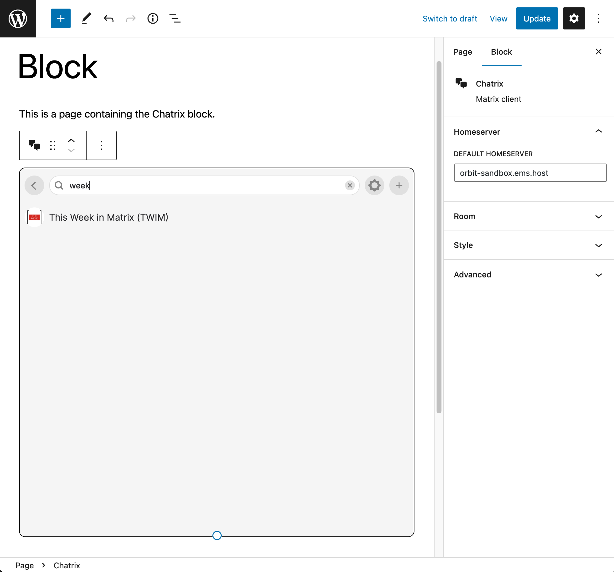

# Chatrix

- Contributors: automattic, akirk, ashfame, psrpinto
- Tags: matrix, chat
- Requires at least: 6.0
- Tested up to: 6.1
- Requires PHP: 7.4
- License: [GPLv2](http://www.gnu.org/licenses/gpl-2.0.html)
- Stable tag: 0.5.1
- GitHub Plugin URI: https://github.com/Automattic/chatrix

Matrix client for WordPress.

## Description
Easily add a [Matrix](https://matrix.org) client to WordPress pages, either through the Block Editor, or as a _popup_.

### Feedback welcome
If you have any feedback or questions about Chatrix, please do talk to plugin maintainers at [#chatrix:matrix.org](https://matrix.to/#/#chatrix:matrix.org).

## Screenshots

## Frequently Asked Questions
### How can I install this plugin on my site?
This plugin can be used in two distinct ways:

1. By adding a block to a page through the block editor
2. By selecting pages in which a _popup_ will be displayed. You configure this through `Settings -> Chatrix`.

### Is there a more flexible way to configure the popup?
Yes. Instead of configuring the _popup_ through `Settings -> Chatrix`, you can configure it through code, by using the `chatrix_instances` filter:

~~~php
// functions.php

add_filter( 'chatrix_instances', function ( array $default_instances ) {
	// The key is an instance_id, the value array is the config for that instance.
	// Set 'pages' to an array of the ids of the pages which should show chatrix.
	// You can also set 'pages' to 'all' which results in that instance always being used.
	// Only one instance can be shown on a given page.
	return array(
		'foo' => array(
			'homeserver' => 'https://foo.com',
			'room_id'    => '!id:foo.com',
			'pages'      => 'all',
		),
		'bar' => array(
			'homeserver' => 'https://bar.com',
			'room_id'    => '!id:bar.com',
			'pages'      => array(1, 2, 3),
		),
	);
} );
~~~

### How can I configure WordPress user accounts to register and login on Matrix homeserver?
The plugin will respect the login methods configured on the Matrix homeserver. You can configure [Open ID Connect (OIDC) login on Synapse](https://matrix-org.github.io/synapse/latest/openid.html). In order to make your WordPress install an OpenID Connect Server/Provider, you can use [OpenID Connect Server plugin](https://wordpress.org/plugins/openid-connect-server/).

## Changelog

### 0.5.1
- Fix issue that caused popup configuration to be ignored [[#173](https://github.com/Automattic/chatrix/pull/173)]

### 0.5.0
- Logout and delete data when user logs out of WordPress [[#150](https://github.com/Automattic/chatrix/pull/150), [#153](https://github.com/Automattic/chatrix/pull/153)]
- Improvements to single room mode [[#151](https://github.com/Automattic/chatrix/pull/151)]
  - Add a Settings entry to the options menu of the room
  - Closing the Settings screen navigates to configured `roomId`
  - Closing the Room (timeline) screen navigates to session picker
  - Hide the left panel completely
- Fix issue that caused Chatrix to not load in certain conditions [[#160](https://github.com/Automattic/chatrix/pull/160)]
- Allow setting a unit for certain styling options (previously was always `px`) [[#154](https://github.com/Automattic/chatrix/pull/154)]

### 0.4.0
- Prevent data corruption when more than one Chatrix instance (block or Popup) is active, either in multiple browser tabs or windows, or in the same page [[#75](https://github.com/Automattic/chatrix/pull/75)]
- Allow setting the height of the block from the block editor [[#135](https://github.com/Automattic/chatrix/pull/135)]
- Allow styling the block's border from the block editor [[#139](https://github.com/Automattic/chatrix/pull/139)]
- Styling and layout improvements and fixes in pre-session screens (session selection, login, logout) [[#134](https://github.com/Automattic/chatrix/pull/134)]
- Reduce plugin size by 50%, from 12MB to 6MB [[#143](https://github.com/Automattic/chatrix/pull/143)]
- Update to Hydrogen [0.3.5](https://github.com/vector-im/hydrogen-web/releases/tag/v0.3.5)
    - Fix issue that prevented opening rooms with slashes in the room ID [[#451](https://github.com/vector-im/hydrogen-web/issues/451)]
    - Improve date headers in room timeline [[#938](https://github.com/vector-im/hydrogen-web/pull/938)]
    - Provide basic UI to join room [[#870](https://github.com/vector-im/hydrogen-web/pull/870)]
    - Fix an error that can stop sync [[#885](https://github.com/vector-im/hydrogen-web/pull/885)]
    - Fetch missing e2ee devices when verifying message sender [[#913](https://github.com/vector-im/hydrogen-web/pull/913)]
    - Fix message verification not working in rooms where we haven't sent a message yet [[#920](https://github.com/vector-im/hydrogen-web/pull/920)]
    - Various maintenance fixes

### 0.3.9
- Initial public release
