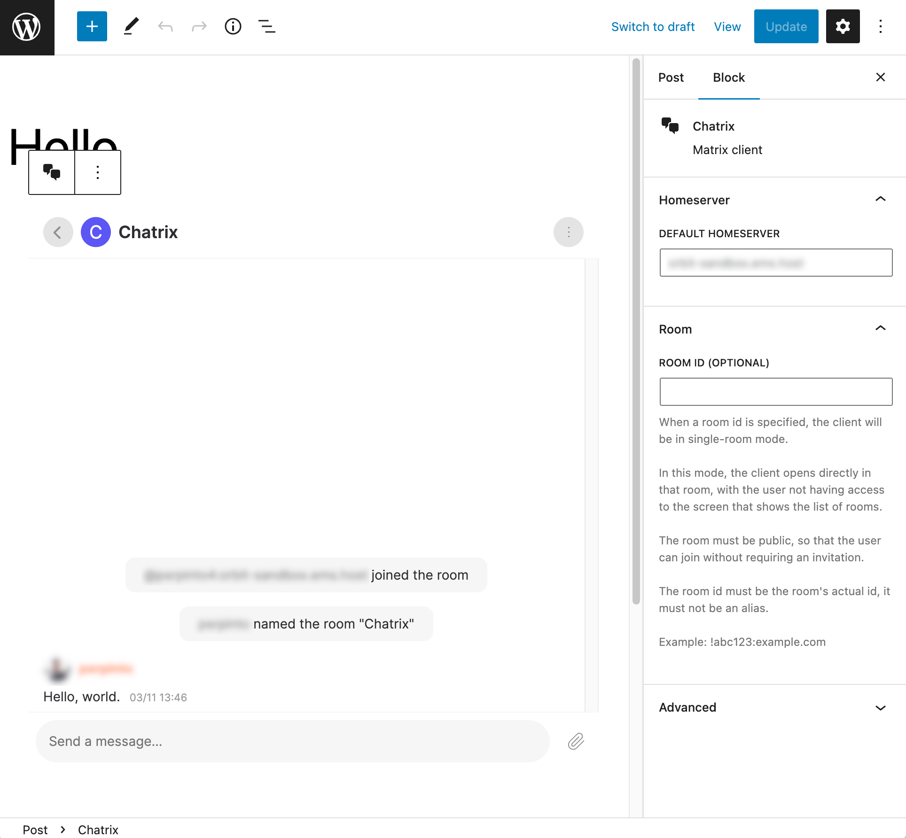

# Chatrix

- Contributors: automattic
- Tags: matrix, chat
- Requires at least: 6.0
- Tested up to: 6.1
- Requires PHP: 7.4
- License: [GPLv2](http://www.gnu.org/licenses/gpl-2.0.html)
- Stable tag: 0.2.2
- GitHub Plugin URI: https://github.com/Automattic/chatrix

Matrix client for WordPress.

## Description
Easily add a [Matrix](https://matrix.org) client to WordPress pages, either through the Block Editor, or as a _popup_.

## Screenshots



## Usage
This plugin can be used in two distinct ways:

1. By adding a block to a page through the block editor
2. By selecting pages in which a _popup_ will be displayed. You configure this through `Settings -> Chatrix`.

## Advanced usage
> This only applies to the _popup_, not to the block.

If you need more flexibility than what the plugin's settings provides, you can configure chatrix though
the `chatrix_instances` filter:

```php
// functions.php

add_filter( 'chatrix_instances', function ( array $default_instances ) {
	// The key is an instance_id, the value array is the config for that instance.
	// Set 'pages' to an array of the ids of the pages which should show chatrix.
	// You can also set 'pages' to 'all' which results in that instance always being used.
	// Only one instance can be shown on a given page.
	return array(
		'foo' => array(
			'homeserver' => 'https://foo.com',
			'room_id'    => '!id:foo.com',
			'pages'      => 'all',
		),
		'bar' => array(
			'homeserver' => 'https://bar.com',
			'room_id'    => '!id:bar.com',
			'pages'      => array(1, 2, 3),
		),
	);
} );
```
